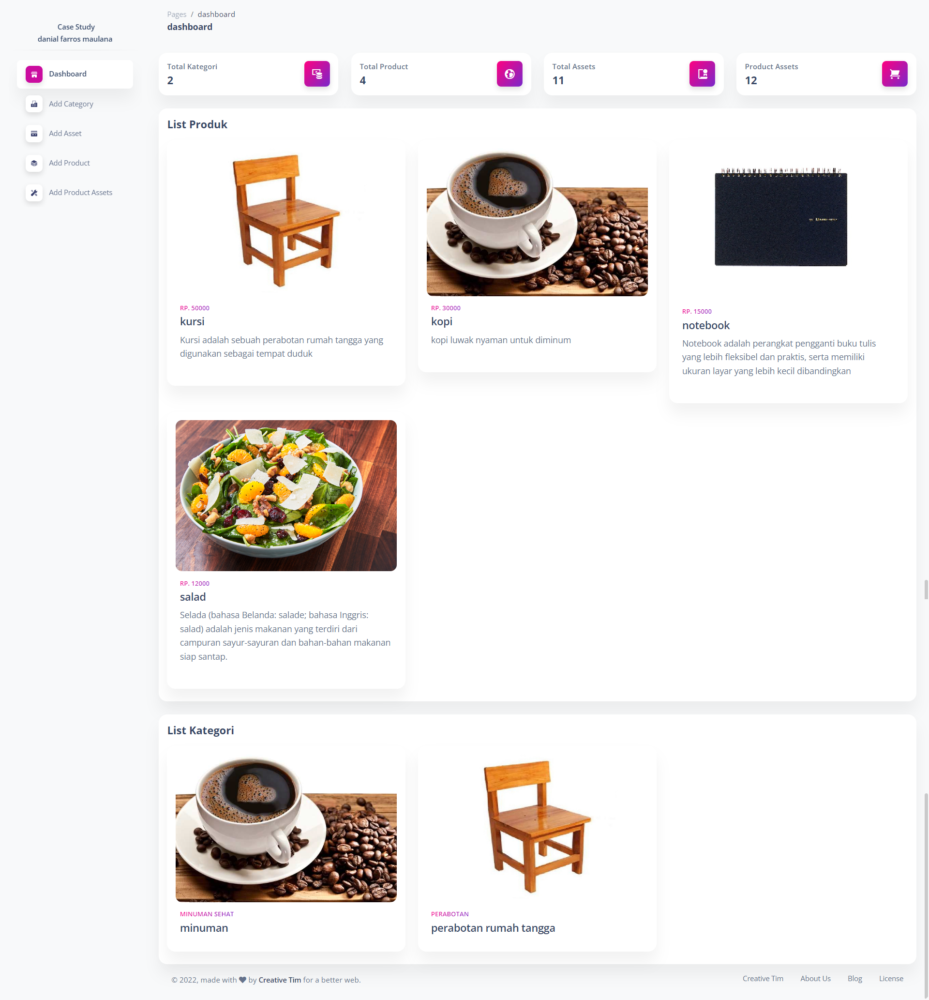
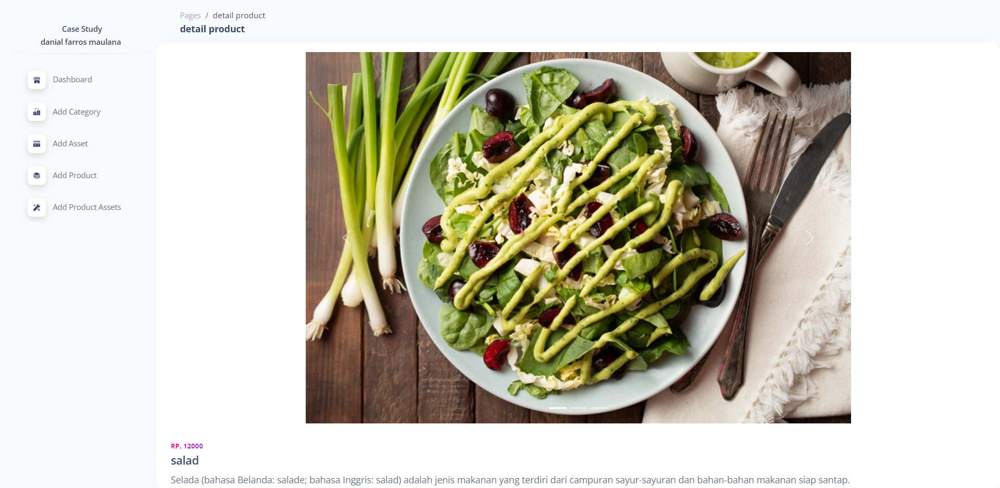

## Panduaan Instalasi
1. Clone repository, bisa di download .zip atau dengan perintah git clone
2. Import database pada file  [Berikut](/studycaseharisenin.sql).
3. Jalankan Laravel dengan perintah
   
   ```php artisan serve```

## Fitur yang tersedia
- melihat data jumlah kategori, produk, aset dan produk assets **(Dashboard)**
- Melihat Produk yang tersedia **(Dashboard)**
- Melihat Kategori yang tersedia **(Dashboard
- )**
- Melihat detail produk **(Dashboard)**
- Menambahkan Kategori
- Menambahkan Asset
- Menambahkan Produk
- Menambahkan Prodsuk Asset

## Dokumentasi Fitur utama
### 1.dokumentasi Dashboard 

### 2.dokumentasi detail product


